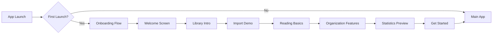

# Onboarding Flow Design

## Overview

This document defines the user onboarding experience for the E-Reader App, designed to introduce new users to key features and guide them through their first book import and reading session.

---

## User Journey Map



---

## Onboarding Screens

### Screen 1: Welcome

**Purpose**: Create excitement and set expectations

| Element | Content |
|---------|---------|
| **Title** | "Your Personal Library, Anywhere" |
| **Subtitle** | "Read EPUB, PDF, and MOBI books with a beautiful, customizable reading experience." |
| **Visual** | Animated book opening or library illustration |
| **CTA** | "Get Started" button |
| **Secondary** | "Skip" link (top right) |

**Features Highlighted**:
- 📚 Multi-format support (EPUB, PDF, MOBI)
- 🎨 Customizable reading experience
- 📊 Reading progress tracking
- ☁️ Works offline

---

### Screen 2: Your Library

**Purpose**: Introduce the main library interface

| Element | Content |
|---------|---------|
| **Title** | "Your Digital Bookshelf" |
| **Description** | "All your books in one place. Browse, search, and organize your collection with ease." |
| **Visual** | Screenshot/mock of LibraryScreen with book cards |
| **Feature Points** | • Grid/List view toggle<br>• Search by title or author<br>• Quick access to favorites<br>• Reading progress at a glance |
| **CTA** | "Next" button |

---

### Screen 3: Import Books

**Purpose**: Guide users through their first book import

| Element | Content |
|---------|---------|
| **Title** | "Add Your Books" |
| **Description** | "Import books from your device or cloud storage. We support EPUB, PDF, and MOBI formats." |
| **Visual** | Animated import flow illustration |
| **Steps Shown** | 1. Tap the + button in Library<br>2. Select your book file<br>3. We handle the rest! |
| **Demo Button** | "Try Import" - Opens document picker for hands-on experience |
| **CTA** | "Next" (or "Skip for Now") |

**Interactive Element**:
- Allow users to actually import a book during onboarding
- If they skip, remind them later with a subtle prompt

---

### Screen 4: Reading Experience

**Purpose**: Showcase reader features and customization

| Element | Content |
|---------|---------|
| **Title** | "Read Your Way" |
| **Description** | "Customize every aspect of your reading experience. From fonts to themes, make it yours." |
| **Visual** | Side-by-side comparison of different themes/settings |
| **Features Highlighted** | • 5 Reading themes (Light, Sepia, Dark, etc.)<br>• Adjustable font size and family<br>• Progress bar customization<br>• Page margins and line height |
| **CTA** | "Next" button |

---

### Screen 5: Bookmarks & Annotations

**Purpose**: Introduce advanced reading features

| Element | Content |
|---------|---------|
| **Title** | "Never Lose Your Place" |
| **Description** | "Bookmark important pages and highlight passages with personal notes." |
| **Visual** | Illustration of bookmark and annotation features |
| **Features Highlighted** | • One-tap bookmarking<br>• Text highlighting with colors<br>• Add personal notes<br>• View all bookmarks in Book Detail |
| **CTA** | "Next" button |

---

### Screen 6: Organization

**Purpose**: Show how to organize books with categories

| Element | Content |
|---------|---------|
| **Title** | "Stay Organized" |
| **Description** | "Create custom categories to organize your library. Fiction, Non-fiction, Academic - you decide!" |
| **Visual** | Categories screen with colorful category chips |
| **Features Highlighted** | • Create unlimited categories<br>• Assign books to multiple categories<br>• Filter library by category<br>• Favorite books for quick access |
| **CTA** | "Next" button |

---

### Screen 7: Statistics

**Purpose**: Highlight reading progress tracking

| Element | Content |
|---------|---------|
| **Title** | "Track Your Reading Journey" |
| **Description** | "See your reading habits, track progress, and celebrate milestones." |
| **Visual** | Stats screen with charts and reading metrics |
| **Metrics Shown** | • Books completed<br>• Reading streak<br>• Total reading time<br>• Pages read today |
| **CTA** | "Next" button |

---

### Screen 8: Get Started

**Purpose**: Final CTA and transition to main app

| Element | Content |
|---------|---------|
| **Title** | "Ready to Start Reading?" |
| **Description** | "Your personal library awaits. Import your first book and begin your reading journey." |
| **Visual** | Celebration/confetti animation |
| **Primary CTA** | "Import My First Book" |
| **Secondary CTA** | "Explore Demo Library" (optional - could load sample books) |

---

## Technical Implementation

### Navigation Structure

```typescript
// Add to RootStackParamList
export type RootStackParamList = {
  Onboarding: undefined;
  MainTabs: undefined;
  // ... existing screens
};
```

### State Management

Use AsyncStorage to track onboarding completion:

```typescript
// services/OnboardingService.ts
export class OnboardingService {
  static readonly ONBOARDING_COMPLETE_KEY = '@onboarding_complete';

  static async isOnboardingComplete(): Promise<boolean> {
    const value = await AsyncStorage.getItem(this.ONBOARDING_COMPLETE_KEY);
    return value === 'true';
  }

  static async setOnboardingComplete(): Promise<void> {
    await AsyncStorage.setItem(this.ONBOARDING_COMPLETE_KEY, 'true');
  }

  static async resetOnboarding(): Promise<void> {
    await AsyncStorage.removeItem(this.ONBOARDING_COMPLETE_KEY);
  }
}
```

### Onboarding Screen Component

```typescript
// screens/OnboardingScreen.tsx
// - Uses react-native-swiper or custom pager
// - Tracks current page index
// - Handles skip/complete actions
// - Supports swipe gestures and button navigation
```

### Conditional Navigation

```typescript
// App.tsx or AppNavigator.tsx
const [isLoading, setIsLoading] = useState(true);
const [showOnboarding, setShowOnboarding] = useState(false);

useEffect(() => {
  checkOnboardingStatus();
}, []);

const checkOnboardingStatus = async () => {
  const complete = await OnboardingService.isOnboardingComplete();
  setShowOnboarding(!complete);
  setIsLoading(false);
};

// Render appropriate navigator
if (isLoading) return <LoadingScreen />;
if (showOnboarding) return <OnboardingNavigator />;
return <MainAppNavigator />;
```

---

## File Structure

```
src/
├── screens/
│   └── onboarding/
│       ├── OnboardingScreen.tsx       # Main container
│       ├── WelcomeSlide.tsx           # Individual slide components
│       ├── LibraryIntroSlide.tsx
│       ├── ImportDemoSlide.tsx
│       ├── ReadingBasicsSlide.tsx
│       ├── OrganizationSlide.tsx
│       ├── StatisticsSlide.tsx
│       └── GetStartedSlide.tsx
├── components/
│   └── onboarding/
│       ├── OnboardingPagination.tsx   # Dot indicators
│       ├── SlideContainer.tsx         # Common slide wrapper
│       └── FeaturePoint.tsx           # Feature list item
├── services/
│   └── OnboardingService.ts           # Storage management
└── constants/
    └── onboarding.ts                  # Onboarding config
```

---

## Design Specifications

### Visual Style
- **Background**: Match app theme (light/dark)
- **Illustrations**: Consistent with Material Design 3
- **Typography**: Use app's font family (Manrope)
- **Animations**: Smooth transitions between slides (300ms)

### Interaction Patterns
- Swipe left/right to navigate
- Tap pagination dots to jump
- Skip button always available
- Progress indicator (e.g., "2 of 8")

### Accessibility
- Screen reader support for all content
- High contrast text
- Minimum touch target 44x44pt
- Reduced motion support

---

## Future Enhancements

1. **Contextual Onboarding**: Show tooltips on first feature use
2. **Video Previews**: Short demo videos for complex features
3. **Personalization**: Ask reading preferences during onboarding
4. **Account Setup**: Optional cloud sync signup
5. **Import Progress**: Show import tutorial if user has 0 books after 3 days

---

## Success Metrics

Track these metrics to measure onboarding effectiveness:

| Metric | Target |
|--------|--------|
| Onboarding Completion Rate | > 80% |
| Book Import within 24h | > 60% |
| Skip Rate | < 20% |
| Time to First Read | < 5 minutes |
| Retention (Day 7) | > 50% |
