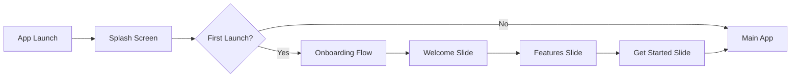

# Onboarding Flow Design

## Overview

This document defines the user onboarding experience for the E-Reader App, designed to introduce new users to key features and guide them through their first book import and reading session.

> **Status**: ✅ Implemented (3-slide simplified flow)

---

## User Journey Map



---

## Implementation Checklist

- [x] SplashScreen component with animated logo
- [x] OnboardingScreen with 3 slides
- [x] WelcomeSlide with MaterialCommunityIcons
- [x] FeatureSlide with feature highlights
- [x] GetStartedSlide with final CTA
- [x] OnboardingService for persistence
- [x] Proper button positioning and styling
- [x] Skip functionality
- [ ] Demo library import (future enhancement)
- [ ] Interactive import during onboarding (future enhancement)

---

## Onboarding Screens (Implemented)

### Slide 1: Welcome (`WelcomeSlide.tsx`)

**Purpose**: Create excitement and set expectations

| Element | Content |
|---------|---------|
| **Title** | "Welcome to Your Digital Library" |
| **Subtitle** | "Your personal reading companion for EPUB and PDF books" |
| **Visual** | Large book icon (`book-open-outline`) in purple circle |
| **CTA** | "Get Started" button |
| **Secondary** | "Skip" link (top right) |

**File**: [`src/screens/onboarding/slides/WelcomeSlide.tsx`](src/screens/onboarding/slides/WelcomeSlide.tsx:1)

---

### Slide 2: Features (`FeatureSlide.tsx`)

**Purpose**: Showcase key app features in a grid layout

| Feature | Icon | Description |
|---------|------|-------------|
| Library | `library` | Organize and browse your book collection |
| Import | `download` | Import EPUB and PDF files from your device |
| Themes | `format-color-fill` | Customize reading experience with themes |
| Bookmarks | `bookmark-outline` | Save your favorite passages |

| Element | Content |
|---------|---------|
| **Title** | "Everything You Need" |
| **Subtitle** | "Powerful features designed for book lovers" |
| **CTA** | "Next" button |
| **Secondary** | "Skip" link |

**File**: [`src/screens/onboarding/slides/FeatureSlide.tsx`](src/screens/onboarding/slides/FeatureSlide.tsx:1)

---

### Slide 3: Get Started (`GetStartedSlide.tsx`)

**Purpose**: Final CTA and transition to main app

| Element | Content |
|---------|---------|
| **Title** | "Ready to Start?" |
| **Subtitle** | "Begin your reading journey today" |
| **Visual** | Rocket/thumbs up icon in purple circle |
| **Primary CTA** | "Get Started" button |
| **Secondary** | "Skip" link |

**File**: [`src/screens/onboarding/slides/GetStartedSlide.tsx`](src/screens/onboarding/slides/GetStartedSlide.tsx:1)

---

## Splash Screen

**Component**: [`src/components/SplashScreen.tsx`](src/components/SplashScreen.tsx:1)

**Features**:
- Animated logo with fade-in effect
- Rotating book icon
- Smooth fade-out transition
- Minimum 2-second display time
- Status bar styling

---

## Future Enhancements (Not Implemented)

### Planned But Simplified
- ~~8-screen detailed walkthrough~~ → Reduced to 3 essential slides
- ~~Interactive import demo~~ → Direct to main app
- ~~Demo library exploration~~ → Auto-download default books
- ~~Statistics preview~~ → Accessible from StatsScreen

### Why Simplified?
- Faster time-to-value for users
- Reduced development complexity
- Can be enhanced later based on user feedback
- Default books provide immediate value

## Original 8-Screen Design (Deprecated)
<details>
<summary>Click to view original extended onboarding design</summary>

1. **Welcome** - Introduction
2. **Your Library** - Library interface
3. **Import Books** - File import guide
4. **Reading Experience** - Customization features
5. **Bookmarks & Annotations** - Advanced features
6. **Organization** - Categories
7. **Statistics** - Reading tracking
8. **Get Started** - Final CTA

*This design was simplified to 3 slides for better UX.*
</details>

---

## Technical Implementation

### Navigation Structure

```typescript
// Add to RootStackParamList
export type RootStackParamList = {
  Onboarding: undefined;
  MainTabs: undefined;
  // ... existing screens
};
```

### State Management

Use AsyncStorage to track onboarding completion:

```typescript
// services/OnboardingService.ts
export class OnboardingService {
  static readonly ONBOARDING_COMPLETE_KEY = '@onboarding_complete';

  static async isOnboardingComplete(): Promise<boolean> {
    const value = await AsyncStorage.getItem(this.ONBOARDING_COMPLETE_KEY);
    return value === 'true';
  }

  static async setOnboardingComplete(): Promise<void> {
    await AsyncStorage.setItem(this.ONBOARDING_COMPLETE_KEY, 'true');
  }

  static async resetOnboarding(): Promise<void> {
    await AsyncStorage.removeItem(this.ONBOARDING_COMPLETE_KEY);
  }
}
```

### Onboarding Screen Component

```typescript
// screens/OnboardingScreen.tsx
// - Uses react-native-swiper or custom pager
// - Tracks current page index
// - Handles skip/complete actions
// - Supports swipe gestures and button navigation
```

### Conditional Navigation

```typescript
// App.tsx or AppNavigator.tsx
const [isLoading, setIsLoading] = useState(true);
const [showOnboarding, setShowOnboarding] = useState(false);

useEffect(() => {
  checkOnboardingStatus();
}, []);

const checkOnboardingStatus = async () => {
  const complete = await OnboardingService.isOnboardingComplete();
  setShowOnboarding(!complete);
  setIsLoading(false);
};

// Render appropriate navigator
if (isLoading) return <LoadingScreen />;
if (showOnboarding) return <OnboardingNavigator />;
return <MainAppNavigator />;
```

---

## File Structure

```
src/
├── screens/
│   └── onboarding/
│       ├── OnboardingScreen.tsx       # Main container
│       ├── WelcomeSlide.tsx           # Individual slide components
│       ├── LibraryIntroSlide.tsx
│       ├── ImportDemoSlide.tsx
│       ├── ReadingBasicsSlide.tsx
│       ├── OrganizationSlide.tsx
│       ├── StatisticsSlide.tsx
│       └── GetStartedSlide.tsx
├── components/
│   └── onboarding/
│       ├── OnboardingPagination.tsx   # Dot indicators
│       ├── SlideContainer.tsx         # Common slide wrapper
│       └── FeaturePoint.tsx           # Feature list item
├── services/
│   └── OnboardingService.ts           # Storage management
└── constants/
    └── onboarding.ts                  # Onboarding config
```

---

## Design Specifications

### Visual Style
- **Background**: Match app theme (light/dark)
- **Illustrations**: Consistent with Material Design 3
- **Typography**: Use app's font family (Manrope)
- **Animations**: Smooth transitions between slides (300ms)

### Interaction Patterns
- Swipe left/right to navigate
- Tap pagination dots to jump
- Skip button always available
- Progress indicator (e.g., "2 of 8")

### Accessibility
- Screen reader support for all content
- High contrast text
- Minimum touch target 44x44pt
- Reduced motion support

---

## Future Enhancements

1. **Contextual Onboarding**: Show tooltips on first feature use
2. **Video Previews**: Short demo videos for complex features
3. **Personalization**: Ask reading preferences during onboarding
4. **Account Setup**: Optional cloud sync signup
5. **Import Progress**: Show import tutorial if user has 0 books after 3 days

---

## Success Metrics

Track these metrics to measure onboarding effectiveness:

| Metric | Target |
|--------|--------|
| Onboarding Completion Rate | > 80% |
| Book Import within 24h | > 60% |
| Skip Rate | < 20% |
| Time to First Read | < 5 minutes |
| Retention (Day 7) | > 50% |
