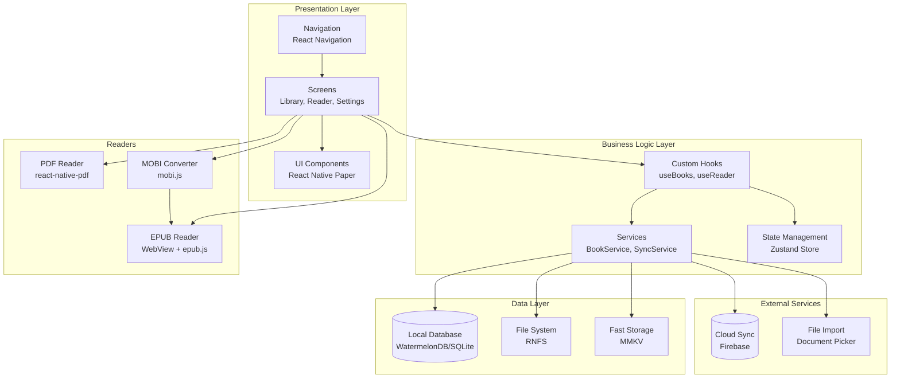
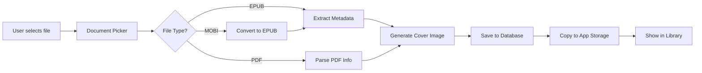
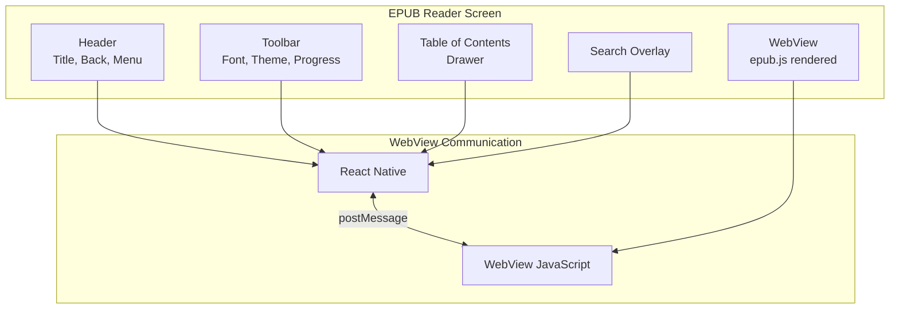
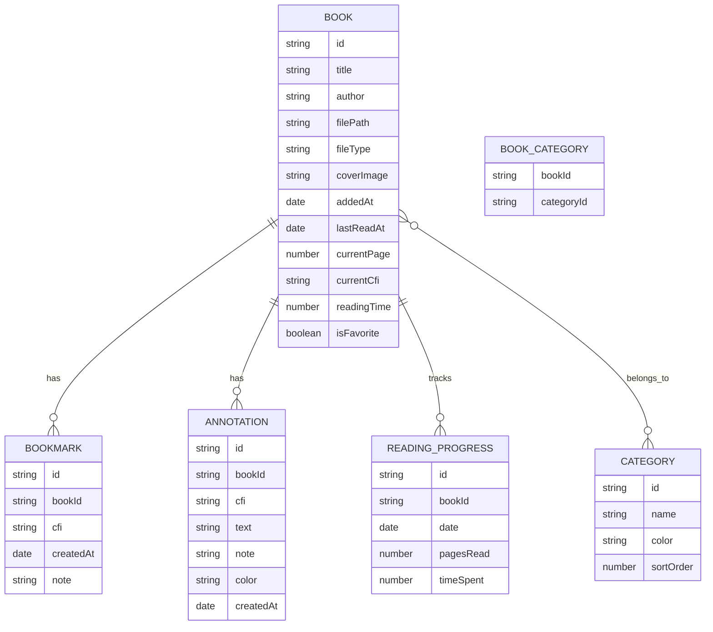
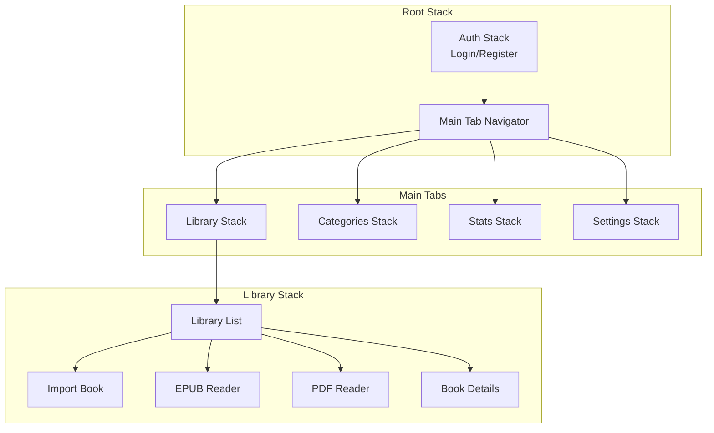
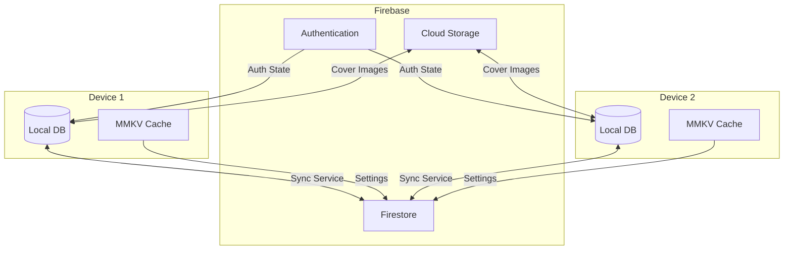

# System Architecture Diagram

## High-Level App Architecture

## Data Flow Diagram

## EPUB Reader Component Structure

## Database Entity Relationship

## Navigation Structure

## Sync Architecture (Phase 10)

