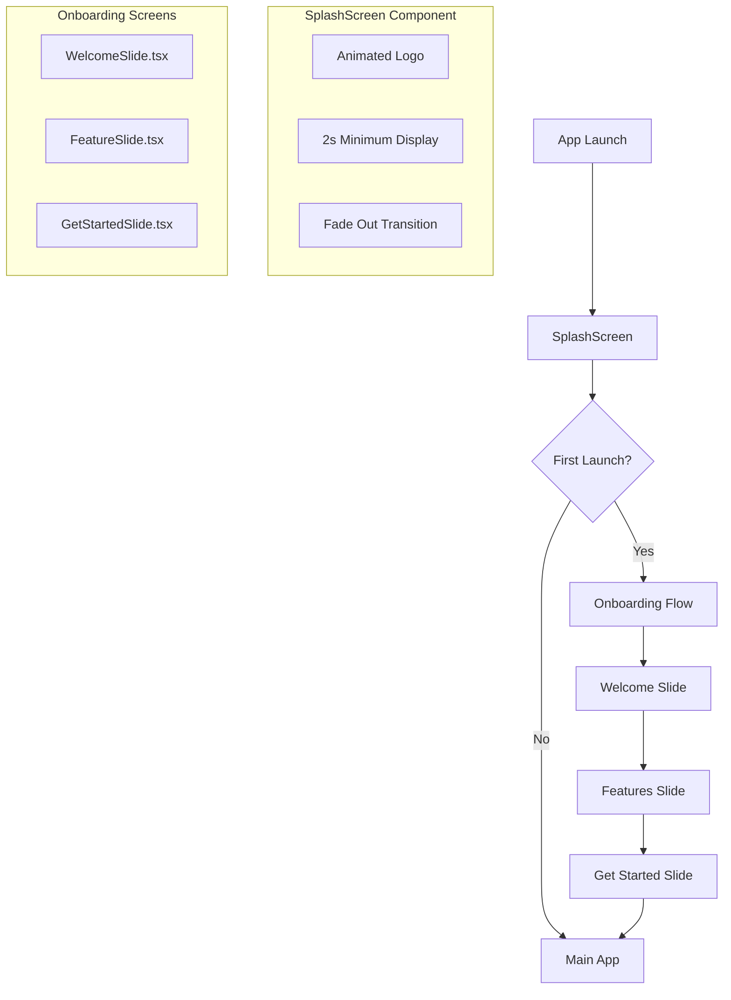
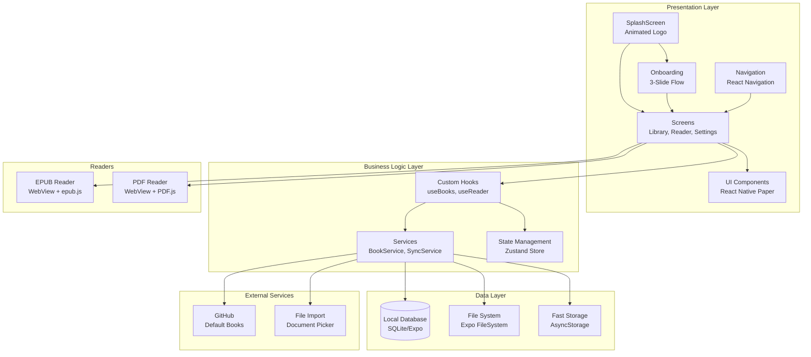
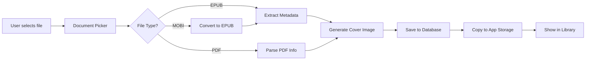
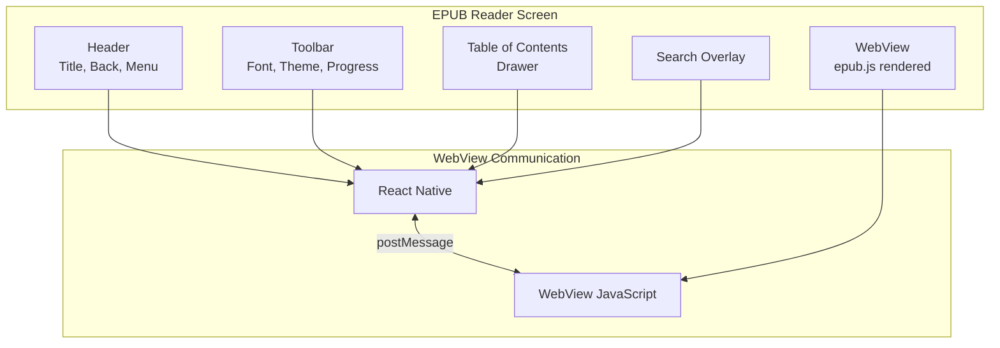
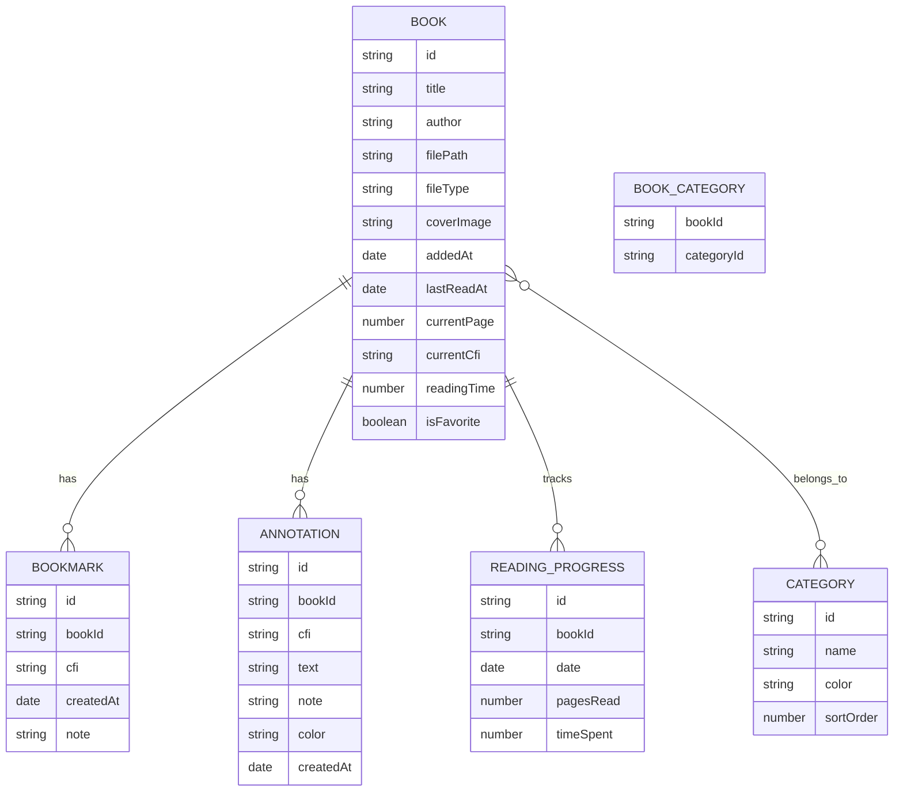
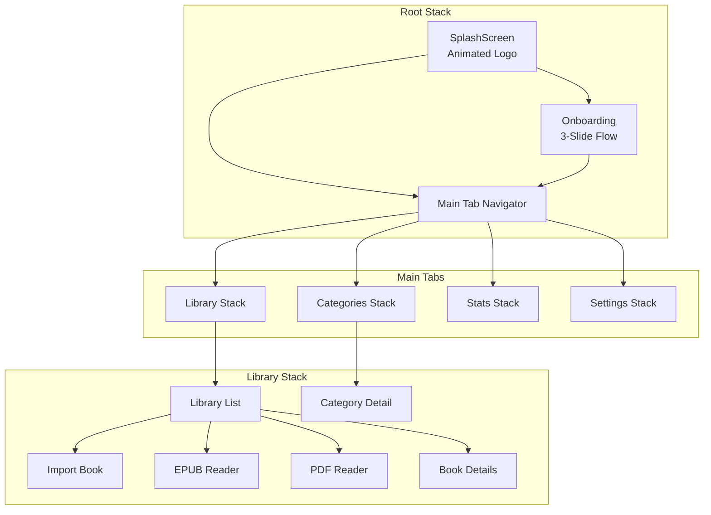
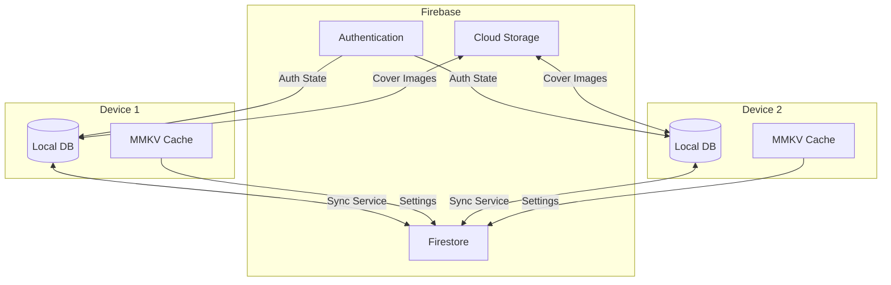

# System Architecture Diagram

> **Last Updated**: 2026-03-03
> **Status**: SplashScreen and Onboarding implemented

## App Launch Flow

```mermaid
flowchart TD
    A[App Launch] --> B[SplashScreen]
    B --> C{First Launch?}
    C -->|Yes| D[Onboarding Flow]
    C -->|No| E[Main App]
    D --> F[Welcome Slide]
    F --> G[Features Slide]
    G --> H[Get Started Slide]
    H --> E

    subgraph "SplashScreen Component"
        B1[Animated Logo]
        B2[2s Minimum Display]
        B3[Fade Out Transition]
    end

    subgraph "Onboarding Screens"
        D1[WelcomeSlide.tsx]
        D2[FeatureSlide.tsx]
        D3[GetStartedSlide.tsx]
    end
```

## High-Level App Architecture

```mermaid
flowchart TB
    subgraph "Presentation Layer"
        SPLASH[SplashScreen<br/>Animated Logo]
        ONBOARD[Onboarding<br/>3-Slide Flow]
        UI[UI Components<br/>React Native Paper]
        SCREENS[Screens<br/>Library, Reader, Settings]
        NAV[Navigation<br/>React Navigation]
    end

    subgraph "Business Logic Layer"
        HOOKS[Custom Hooks<br/>useBooks, useReader]
        SERVICES[Services<br/>BookService, SyncService]
        STATE[State Management<br/>Zustand Store]
    end

    subgraph "Data Layer"
        DB[(Local Database<br/>SQLite/Expo)]
        FILESYS[File System<br/>Expo FileSystem]
        CACHE[Fast Storage<br/>AsyncStorage]
    end

    subgraph "External Services"
        GITHUB[GitHub<br/>Default Books]
        IMPORT[File Import<br/>Document Picker]
    end

    subgraph "Readers"
        EPUB[EPUB Reader<br/>WebView + epub.js]
        PDF[PDF Reader<br/>WebView + PDF.js]
    end

    SPLASH --> ONBOARD
    SPLASH --> SCREENS
    ONBOARD --> SCREENS
    SCREENS --> HOOKS
    SCREENS --> UI
    NAV --> SCREENS
    HOOKS --> SERVICES
    HOOKS --> STATE
    SERVICES --> DB
    SERVICES --> FILESYS
    SERVICES --> CACHE
    SERVICES --> GITHUB
    SERVICES --> IMPORT
    SCREENS --> EPUB
    SCREENS --> PDF
```

## Data Flow Diagram

```mermaid
flowchart LR
    A[User selects file] --> B[Document Picker]
    B --> C{File Type?}
    C -->|EPUB| D[Extract Metadata]
    C -->|PDF| E[Parse PDF Info]
    C -->|MOBI| F[Convert to EPUB]
    F --> D
    D --> G[Generate Cover Image]
    E --> G
    G --> H[Save to Database]
    H --> I[Copy to App Storage]
    I --> J[Show in Library]
```

## EPUB Reader Component Structure

```mermaid
flowchart TB
    subgraph "EPUB Reader Screen"
        HEADER[Header<br/>Title, Back, Menu]
        WEBVIEW[WebView<br/>epub.js rendered]
        TOOLBAR[Toolbar<br/>Font, Theme, Progress]
        TOC[Table of Contents<br/>Drawer]
        SEARCH[Search Overlay]
    end

    subgraph "WebView Communication"
        RN[React Native]
        WV[WebView JavaScript]
        RN <-->|postMessage| WV
    end

    WEBVIEW --> WV
    HEADER --> RN
    TOOLBAR --> RN
    TOC --> RN
    SEARCH --> RN
```

## Database Entity Relationship

```mermaid
erDiagram
    BOOK ||--o{ BOOKMARK : has
    BOOK ||--o{ ANNOTATION : has
    BOOK ||--o{ READING_PROGRESS : tracks
    BOOK }o--o{ CATEGORY : belongs_to

    BOOK {
        string id
        string title
        string author
        string filePath
        string fileType
        string coverImage
        date addedAt
        date lastReadAt
        number currentPage
        string currentCfi
        number readingTime
        boolean isFavorite
    }

    CATEGORY {
        string id
        string name
        string color
        number sortOrder
    }

    BOOKMARK {
        string id
        string bookId
        string cfi
        date createdAt
        string note
    }

    ANNOTATION {
        string id
        string bookId
        string cfi
        string text
        string note
        string color
        date createdAt
    }

    READING_PROGRESS {
        string id
        string bookId
        date date
        number pagesRead
        number timeSpent
    }

    BOOK_CATEGORY {
        string bookId
        string categoryId
    }
```

## Navigation Structure (Updated)

```mermaid
flowchart TB
    subgraph "Root Stack"
        SPLASH[SplashScreen<br/>Animated Logo]
        ONBOARD[Onboarding<br/>3-Slide Flow]
        MAIN[Main Tab Navigator]
    end

    subgraph "Main Tabs"
        LIBRARY[Library Stack]
        CATEGORIES[Categories Stack]
        STATS[Stats Stack]
        SETTINGS[Settings Stack]
    end

    subgraph "Library Stack"
        LIB_LIST[Library List]
        IMPORT[Import Book]
        READER_E[EPUB Reader]
        READER_P[PDF Reader]
        BOOK_DETAIL[Book Details]
        CAT_DETAIL[Category Detail]
    end

    SPLASH --> ONBOARD
    SPLASH --> MAIN
    ONBOARD --> MAIN
    MAIN --> LIBRARY
    MAIN --> CATEGORIES
    MAIN --> STATS
    MAIN --> SETTINGS
    LIBRARY --> LIB_LIST
    LIB_LIST --> IMPORT
    LIB_LIST --> BOOK_DETAIL
    LIB_LIST --> READER_E
    LIB_LIST --> READER_P
    CATEGORIES --> CAT_DETAIL
```

## Sync Architecture (Phase 10)

```mermaid
flowchart TB
    subgraph "Device 1"
        D1_DB[(Local DB)]
        D1_CACHE[MMKV Cache]
    end

    subgraph "Firebase"
        FB_AUTH[Authentication]
        FB_STORE[Firestore]
        FB_STORAGE[Cloud Storage]
    end

    subgraph "Device 2"
        D2_DB[(Local DB)]
        D2_CACHE[MMKV Cache]
    end

    D1_DB <-->|Sync Service| FB_STORE
    D1_CACHE -->|Settings| FB_STORE
    FB_AUTH -->|Auth State| D1_DB
    FB_STORAGE <-->|Cover Images| D1_DB

    D2_DB <-->|Sync Service| FB_STORE
    D2_CACHE -->|Settings| FB_STORE
    FB_AUTH -->|Auth State| D2_DB
    FB_STORAGE <-->|Cover Images| D2_DB
```

---

# Implementation Checklist

## Architecture Components
- [x] SplashScreen component with animation
- [x] Onboarding flow (3 slides)
- [x] Main Tab Navigator (Library, Categories, Stats, Settings)
- [x] Library Stack navigation
- [x] EPUB Reader with WebView
- [x] PDF Reader with WebView
- [x] SQLite database integration
- [x] FileSystem operations
- [x] GitHub default books integration

## Data Layer
- [x] Book entity
- [x] Category entity
- [x] Bookmark entity
- [x] Annotation entity
- [x] ReadingProgress entity
- [x] BookCategory junction table

## Services
- [x] BookService
- [x] DatabaseService
- [x] ReaderService
- [x] StorageService
- [x] SettingsService
- [x] OnboardingService
- [x] TrackingService
- [x] DeviceInfoService

## Future Enhancements
- [ ] Firebase Cloud Sync
- [ ] MOBI format support
- [ ] Authentication (Login/Register)
- [ ] iOS-specific optimizations
